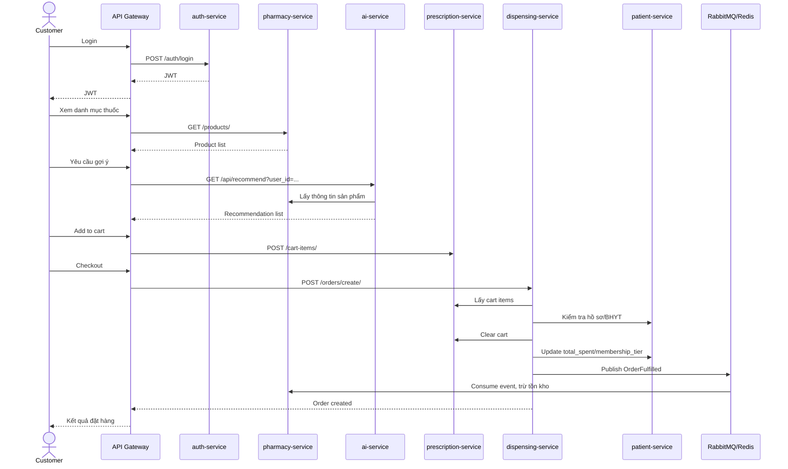

# Notes ý chính từ PDF - Kiến trúc Microservices, DDD và AI Service

> Mục đích: file này dùng làm bộ ghi chú nền để đưa vào project hoặc làm dữ liệu đầu vào cho việc sinh một báo cáo mới. Nội dung đã được rút gọn theo hướng dễ tái sử dụng, không trình bày lại toàn bộ PDF.

---

## 1. Chủ đề tổng quan

PDF tập trung vào việc thiết kế một hệ thống **Healthcare E-Commerce** theo kiến trúc **Microservices**, áp dụng **Domain Driven Design (DDD)** và tích hợp **AI Service** để gợi ý sản phẩm, tư vấn y tế.

Các trục nội dung chính:

- Chuyển đổi tư duy từ **Monolithic Architecture** sang **Microservices Architecture**.
- Áp dụng **DDD** để phân rã hệ thống theo nghiệp vụ thay vì chia theo tầng kỹ thuật.
- Thiết kế hệ thống e-commerce y tế gồm nhiều service độc lập.
- Thiết kế AI Service gồm Recommendation, Chatbot, Knowledge Graph và RAG.
- Xây dựng hệ thống hoàn chỉnh với API Gateway, JWT, Docker, message queue, logging và monitoring.

---

## 2. Monolithic Architecture

### 2.1. Khái niệm

Monolithic Architecture là mô hình trong đó toàn bộ hệ thống được xây dựng và triển khai như một khối duy nhất. Các phần như giao diện, xử lý nghiệp vụ và truy cập cơ sở dữ liệu cùng nằm trong một ứng dụng/process.

### 2.2. Cấu trúc điển hình

- **Presentation Layer**: hiển thị giao diện người dùng.
- **Business Logic Layer**: xử lý nghiệp vụ chính.
- **Data Access Layer**: truy vấn và thao tác với cơ sở dữ liệu.

### 2.3. Ưu điểm khi dùng Monolithic

- Dễ phát triển ở giai đoạn đầu.
- Dễ deploy vì chỉ có một ứng dụng.
- Phù hợp với MVP hoặc hệ thống nhỏ.
- Phù hợp với team ít người, nghiệp vụ chưa phức tạp.

### 2.4. Nhược điểm

- Khó mở rộng từng module riêng lẻ.
- Coupling cao, thay đổi một module có thể ảnh hưởng toàn hệ thống.
- Deploy rủi ro vì lỗi nhỏ có thể làm sập toàn bộ ứng dụng.
- Khó phối hợp khi nhiều team cùng sửa chung một codebase.
- Khi tích hợp module nặng như AI, toàn hệ thống dễ bị bottleneck.

### 2.5. Khi nào nên dùng

- Dự án nhỏ.
- MVP cần ra nhanh.
- Nghiệp vụ đơn giản.
- Team chưa có kinh nghiệm vận hành hệ thống phân tán.

---

## 3. Microservices Architecture

### 3.1. Khái niệm

Microservices là kiến trúc chia hệ thống thành nhiều service nhỏ, mỗi service đảm nhiệm một nghiệp vụ riêng, có thể deploy, scale và bảo trì độc lập.

### 3.2. Đặc điểm chính

- Mỗi service có database riêng: **Database-per-service**.
- Các service giao tiếp qua REST API, gRPC hoặc Message Broker.
- Mỗi service có thể deploy độc lập.
- Có thể scale riêng từng service theo tải thực tế.

### 3.3. So sánh Monolithic và Microservices

| Tiêu chí | Monolithic | Microservices |
|---|---|---|
| Deploy | Deploy toàn bộ ứng dụng một lần | Deploy độc lập từng service |
| Scale | Scale toàn hệ thống | Scale riêng từng service |
| Coupling | Cao | Thấp |
| Database | Dùng chung DB lớn | Mỗi service sở hữu DB riêng |
| Fault isolation | Lỗi một module có thể làm sập toàn hệ thống | Lỗi một service không nhất thiết làm sập toàn hệ thống |
| Phát triển nhóm | Nhiều team dễ conflict chung codebase | Mỗi team có thể sở hữu một service |

### 3.4. Ưu điểm

- Scale độc lập, tối ưu tài nguyên.
- Tăng tốc độ phát triển vì nhiều team làm song song.
- Phù hợp hệ thống lớn, phức tạp.
- Dễ thay đổi công nghệ ở từng service nếu cần.
- Fault isolation tốt hơn Monolithic.

### 3.5. Nhược điểm

- Độ phức tạp vận hành cao.
- Khó debug do lỗi có thể nằm ở nhiều service.
- Cần xử lý vấn đề network, timeout, retry, transaction phân tán.
- Cần logging, monitoring và tracing tốt.

### 3.6. Nguyên tắc thiết kế

- **Single Responsibility**: mỗi service chỉ đảm nhận một trách nhiệm chính.
- **Loose Coupling**: giảm phụ thuộc giữa các service.
- **High Cohesion**: gom các logic liên quan chặt chẽ vào cùng service.
- **Database Ownership**: service nào sở hữu database của service đó.
- **No Direct DB Access**: service không được truy cập trực tiếp DB của service khác.

---

## 4. Domain Driven Design (DDD)

### 4.1. Mục tiêu

DDD giúp thiết kế phần mềm dựa trên nghiệp vụ thực tế, tạo ra mô hình rõ ràng, dễ trao đổi giữa lập trình viên và người hiểu nghiệp vụ.

### 4.2. Khái niệm cốt lõi

- **Entity**: đối tượng có định danh riêng, ví dụ User, Product, Order.
- **Value Object**: đối tượng không có ID, so sánh bằng giá trị, ví dụ Address, Money.
- **Aggregate**: cụm Entity/Value Object liên quan, ví dụ Order gồm OrderItem.
- **Aggregate Root**: đối tượng gốc quản lý tính nhất quán của Aggregate.
- **Bounded Context**: ranh giới nghiệp vụ rõ ràng, ví dụ Order Context, User Context.
- **Context Map**: mô tả quan hệ giữa các Bounded Context.

### 4.3. DDD trong Microservices

Nguyên tắc quan trọng: **mỗi Bounded Context nên ánh xạ thành một microservice**.

Không nên phân rã service theo tầng kỹ thuật như `UI Service`, `Database Service`, `Controller Service`. Nên phân rã theo nghiệp vụ như `auth-service`, `order-service`, `pharmacy-service`.

---

## 5. Case Study: Healthcare E-Commerce

### 5.1. Bài toán

Hệ thống e-commerce y tế cần quản lý:

- Người dùng và xác thực.
- Hồ sơ bệnh nhân.
- Danh mục thuốc/sản phẩm y tế.
- Đơn thuốc tạm hoặc giỏ hàng.
- Đặt hàng, thanh toán, xuất thuốc.
- Đánh giá cộng đồng.
- AI tư vấn và gợi ý sản phẩm.

### 5.2. Domain chính

- **Identity & Access**: xác thực, phân quyền.
- **Patient Management**: hồ sơ bệnh nhân, bảo hiểm y tế.
- **Pharmacy Catalog**: thuốc, kho, lô hàng.
- **Medical Reference**: danh mục y khoa, ICD-10.
- **Prescription**: đơn thuốc tạm/giỏ hàng.
- **Dispensing & Fulfillment**: tạo đơn, thanh toán, xuất thuốc.
- **Community Review**: đánh giá hiệu quả điều trị.
- **Medical AI Advisory**: chatbot, GraphRAG, recommender.

### 5.3. Bounded Context và service tương ứng

| Bounded Context | Service | Port gợi ý | Công nghệ |
|---|---|---:|---|
| Identity & Access | auth-service | 8012 | FastAPI |
| Patient Management | patient-service | 8001 | Django |
| Pharmacy Catalog | pharmacy-service | 8002 | Django |
| Medical Reference | medical-catalog-service | 8003 | Django |
| Prescription | prescription-service | 8004 | FastAPI |
| Dispensing & Fulfillment | dispensing-service | 8005 | Django |
| Community Review | medical-review-service | 8006 | Django/FastAPI |
| AI Advisory | ai-service | 8010 | FastAPI/Python |
| API Gateway | api-gateway | 8000 | Nginx |

### 5.4. Quan hệ giữa các service

- `dispensing-service` lấy dữ liệu giỏ/đơn tạm từ `prescription-service`.
- `dispensing-service` kiểm tra thông tin bệnh nhân và bảo hiểm qua `patient-service`.
- `ai-service` truy vấn `pharmacy-service` để lấy danh sách sản phẩm cho gợi ý.
- Sau khi đơn hoàn tất, `dispensing-service` publish event `OrderFulfilled` để `pharmacy-service` trừ tồn kho.
- Giao tiếp đồng bộ qua REST API.
- Giao tiếp bất đồng bộ qua Redis/RabbitMQ.

---

## 6. Yêu cầu hệ thống

### 6.1. Functional Requirements

- Quản lý sản phẩm y tế: thuốc kê đơn, thuốc OTC, thiết bị y tế, thực phẩm chức năng.
- Quản lý người dùng: đăng ký, đăng nhập, JWT, phân quyền Admin/Staff/Customer.
- Quản lý hồ sơ bệnh nhân: thông tin cá nhân, bảo hiểm, hạng thành viên.
- Giỏ hàng/đơn thuốc tạm: thêm, sửa số lượng, xóa sản phẩm, xóa sau checkout.
- Đặt hàng và xuất thuốc: tạo order, áp dụng bảo hiểm, cập nhật trạng thái.
- Thanh toán: COD, chuyển khoản, BHYT.
- Giao hàng/nhận thuốc: pickup, express, standard.
- AI gợi ý sản phẩm cá nhân hóa.
- Chatbot tư vấn y tế dựa trên GraphRAG.
- Đánh giá hiệu quả điều trị từ người dùng.

### 6.2. Non-functional Requirements

- **Scalability**: scale độc lập từng service.
- **High Availability**: lỗi một service không làm sập toàn hệ thống.
- **Security**: JWT, RBAC, API Gateway validation, không expose service nội bộ.
- **Maintainability**: kiến trúc DDD 4-layer, mỗi service có test và database riêng.
- **Performance**: REST response mục tiêu dưới 200ms, AI chat mục tiêu dưới 30s.
- **Observability**: cần logging, monitoring, tracing để debug luồng liên service.

---

## 7. Thiết kế các service nghiệp vụ

### 7.1. Product Service

Service liên quan:

- `pharmacy-service`: quản lý thuốc, sản phẩm, kho, lô hàng.
- `medical-catalog-service`: quản lý danh mục y khoa, ICD-10.

Entity chính:

- `Product`
  - product_code
  - name
  - generic_name
  - category
  - dosage_form
  - price
  - stock_quantity
  - requires_prescription
  - symptom_tags
  - manufacturer

- `Batch`
  - product
  - batch_number
  - quantity
  - mfg_date
  - expiry_date

- `Category`
  - name
  - slug
  - description
  - parent

API gợi ý:

```http
GET    /products/              -- Danh sách thuốc, filter, search
POST   /products/              -- Tạo sản phẩm mới, Admin
GET    /products/{id}/         -- Chi tiết sản phẩm
GET    /categories/            -- Danh mục ICD-10
POST   /inventory/adjust/      -- Cập nhật tồn kho, Staff
```

### 7.2. User/Auth/Patient Service

Service liên quan:

- `auth-service`: xác thực, tài khoản, JWT.
- `patient-service`: hồ sơ bệnh nhân.

Vai trò người dùng:

- **Admin**: toàn quyền quản lý hệ thống.
- **Staff**: xử lý đơn thuốc, kiểm kho, cập nhật tồn kho.
- **Customer/Patient**: xem thuốc, tư vấn AI, đặt thuốc, thanh toán.

Entity chính:

- `User`
  - id
  - email
  - password_hash
  - fullname
  - is_active
  - failed_attempts

- `Patient`
  - account_id
  - fullname
  - blood_type
  - insurance_code
  - total_spent
  - membership_tier

API gợi ý:

```http
POST /auth/register       -- Đăng ký
POST /auth/login          -- Đăng nhập, trả JWT
POST /auth/validate       -- Validate token nội bộ
POST /auth/refresh        -- Refresh access token
GET  /patients/{id}/      -- Xem hồ sơ bệnh nhân
PUT  /patients/{id}/      -- Cập nhật hồ sơ
```

### 7.3. Prescription/Cart Service

Service liên quan: `prescription-service`.

Vai trò: quản lý đơn thuốc tạm/giỏ hàng trước khi checkout.

Entity chính:

- `CartItem`
  - customer_id
  - product_id
  - quantity
  - unit_price
  - product_name
  - created_at

Logic chính:

- Thêm sản phẩm vào giỏ.
- Cập nhật số lượng.
- Xóa sản phẩm khỏi giỏ.
- Lấy toàn bộ giỏ theo customer_id.
- Xóa toàn bộ giỏ sau khi tạo đơn thành công.

API gợi ý:

```http
POST   /cart-items/             -- Thêm thuốc vào đơn tạm
GET    /cart-items/{cust_id}/   -- Xem đơn tạm
PUT    /cart-items/{id}/        -- Cập nhật số lượng
DELETE /cart-items/{id}/        -- Xóa một dòng thuốc
DELETE /carts/{cust_id}/        -- Xóa toàn bộ giỏ sau checkout
```

### 7.4. Dispensing/Order Service

Service liên quan: `dispensing-service`.

Vai trò: xử lý tạo đơn, tính tiền, áp dụng BHYT, cập nhật trạng thái, phát thuốc.

Entity chính:

- `Order`
  - customer_id
  - status
  - payment_method
  - discount_rate
  - total_amount
  - shipping_method
  - shipping_address
  - note
  - created_at

- `OrderItem`
  - order_id
  - product_id
  - name
  - price
  - quantity

Trạng thái đơn hàng:

- `PENDING`: đơn vừa tạo, chờ xác nhận.
- `CONFIRMED`: staff đã xác nhận.
- `DISPENSED`: thuốc đã được phát/giao.
- `CANCELLED`: đơn bị hủy.

Workflow chính:

1. Lấy items từ `prescription-service`.
2. Kiểm tra hồ sơ bệnh nhân qua `patient-service`.
3. Nếu có `insurance_code`, áp dụng giảm 20%.
4. Tạo Order và OrderItem.
5. Xóa giỏ hàng ở `prescription-service`.
6. Cập nhật `total_spent` và `membership_tier` ở `patient-service`.
7. Publish event `OrderFulfilled` để `pharmacy-service` trừ tồn kho.

API gợi ý:

```http
POST /orders/create/          -- Tạo đơn + tính tiền + áp dụng BHYT
GET  /orders/{id}/            -- Tra cứu trạng thái đơn
PUT  /orders/{id}/status/     -- Cập nhật trạng thái
```

### 7.5. Payment và Shipping

Trong thiết kế PDF, Payment và Shipping có thể được tích hợp trong `dispensing-service` vì chúng gắn chặt với nghiệp vụ phát thuốc.

Payment method:

- `COD`
- `BANK_TRANSFER`
- `BHYT`

Shipping method:

- `PICKUP`: lấy tại cửa hàng.
- `EXPRESS`: giao nhanh.
- `STANDARD`: giao tiêu chuẩn.

---

## 8. Luồng xử lý tổng thể

### 8.1. Luồng mua hàng/đặt thuốc

1. Người dùng đăng nhập qua API Gateway.
2. `auth-service` cấp JWT.
3. Người dùng xem danh mục thuốc qua `pharmacy-service`.
4. `ai-service` có thể gợi ý sản phẩm cá nhân hóa.
5. Người dùng thêm sản phẩm vào đơn tạm qua `prescription-service`.
6. Khi checkout, `dispensing-service` lấy items từ `prescription-service`.
7. `dispensing-service` kiểm tra bảo hiểm qua `patient-service`.
8. Tạo order, tính tiền, áp dụng giảm giá nếu có BHYT.
9. Xóa giỏ hàng sau checkout.
10. Cập nhật tổng chi tiêu và hạng thành viên cho bệnh nhân.
11. Publish `OrderFulfilled` event.
12. `pharmacy-service` nhận event và trừ tồn kho.
13. Người dùng có thể đánh giá hiệu quả điều trị qua `medical-review-service`.
14. AI cập nhật behavior graph để cải thiện gợi ý.

### 8.2. Mermaid sequence gợi ý



---

## 9. Mapping Class Diagram sang Database

### 9.1. Nguyên tắc mapping

- Mỗi Aggregate Root/Entity ánh xạ thành một table.
- Mỗi attribute ánh xạ thành một column.
- Association/Composition ánh xạ thành foreign key trong cùng service.
- Value Object có thể được flatten thành các column trong table cha.
- Không tạo foreign key xuyên database/service.
- Nếu cần liên kết xuyên service, dùng logical key như `account_id`, `product_id`, `customer_id`.

### 9.2. Database-per-service

Mỗi service có database/schema riêng:

- `auth_db`
- `patient_db`
- `pharmacy_db`
- `prescription_db`
- `dispensing_db`
- `review_db`
- `ai_db` hoặc graph/vector storage riêng

### 9.3. PostgreSQL

PDF chọn PostgreSQL vì:

- Hỗ trợ JSONB tốt, phù hợp field linh hoạt như `symptom_tags`.
- ACID tốt.
- Phù hợp dữ liệu quan hệ phức tạp.
- Hỗ trợ array, enum, JSONB.

### 9.4. Bảng gợi ý

#### products

```sql
CREATE TABLE products (
    id SERIAL PRIMARY KEY,
    product_code VARCHAR(20) UNIQUE NOT NULL,
    name VARCHAR(255) NOT NULL,
    category VARCHAR(100),
    price NUMERIC(12,2),
    stock_quantity INTEGER DEFAULT 0,
    requires_prescription BOOLEAN DEFAULT FALSE,
    symptom_tags JSONB DEFAULT '[]'
);
```

#### batches

```sql
CREATE TABLE batches (
    id SERIAL PRIMARY KEY,
    product_id INTEGER REFERENCES products(id),
    batch_number VARCHAR(50),
    quantity INTEGER,
    mfg_date DATE,
    expiry_date DATE
);
```

#### patients

```sql
CREATE TABLE patients (
    id SERIAL PRIMARY KEY,
    account_id INTEGER UNIQUE NOT NULL,
    fullname VARCHAR(255),
    blood_type VARCHAR(5),
    insurance_code VARCHAR(50),
    total_spent NUMERIC(12,2) DEFAULT 0,
    membership_tier VARCHAR(10) DEFAULT 'BRONZE'
);
```

#### orders

```sql
CREATE TABLE orders (
    id UUID PRIMARY KEY DEFAULT gen_random_uuid(),
    customer_id VARCHAR(50) NOT NULL,
    status VARCHAR(50) DEFAULT 'PENDING',
    payment_method VARCHAR(50),
    discount_amount NUMERIC(12,2) DEFAULT 0.0,
    total_amount NUMERIC(12,2),
    shipping_street VARCHAR(255),
    shipping_city VARCHAR(100),
    shipping_district VARCHAR(100),
    has_prescription BOOLEAN DEFAULT FALSE,
    prescription_id VARCHAR(100),
    created_at TIMESTAMP DEFAULT NOW()
);
```

#### order_items

```sql
CREATE TABLE order_items (
    id SERIAL PRIMARY KEY,
    order_id UUID REFERENCES orders(id),
    product_id INTEGER NOT NULL,
    product_name VARCHAR(255),
    quantity INTEGER,
    unit_price NUMERIC(12,2),
    line_total NUMERIC(12,2),
    quantity_dispensed INTEGER DEFAULT 0,
    dispensed_by VARCHAR(100)
);
```

---

## 10. AI Service

### 10.1. Mục tiêu

AI Service hỗ trợ:

- Gợi ý sản phẩm cá nhân hóa.
- Chatbot tư vấn y tế.
- Phân tích hành vi người dùng.
- Kết hợp dữ liệu sản phẩm, triệu chứng, bệnh và lịch sử tương tác.

### 10.2. Dữ liệu đầu vào

Behavior log cần ghi nhận:

- `user_id`
- `product_id`
- `action`: view, click, add_to_cart, purchase
- `timestamp`

Nguồn dữ liệu y khoa:

- ICD-10.
- PubMed hoặc tài liệu y khoa.
- Medical Knowledge Graph.
- Log tương tác giả lập hoặc thực tế.

### 10.3. Các thành phần AI

#### LSTM / Sequence Modeling

- Dự đoán sản phẩm tiếp theo dựa trên chuỗi hành vi người dùng.
- Phù hợp với dữ liệu có thứ tự thời gian.

#### Knowledge Graph / Neo4j

Biểu diễn quan hệ:

- User - VIEW/BUY - Product
- Symptom - INDICATES - Disease
- Disease - TREATS - Product
- Product - SIMILAR - Product

Ví dụ truy vấn ý tưởng:

```cypher
MATCH (s:Symptom {name: "Dau da day"})
      -[:INDICATES]->(d:Disease)
      -[:TREATS]->(p:Product)
RETURN s.name, d.name, p.name, p.category
```

#### RAG Pipeline

RAG gồm 3 bước:

1. **Retrieve**: FAISS tìm đoạn tài liệu/sản phẩm liên quan dựa trên embedding.
2. **Augment**: kết hợp kết quả từ FAISS, Neo4j và pharmacy-service vào prompt.
3. **Generate**: LLM sinh câu trả lời tự nhiên.

#### Hybrid Recommendation

Kết hợp nhiều nguồn điểm:

```text
final_score = w1 * lstm + w2 * graph + w3 * rag
```

Trong phần triển khai nâng cao, PDF cũng nhắc đến GNN + SPD-AIRM:

```text
final_score = w1 * gnn + w2 * airm
```

### 10.4. API AI Service

```http
GET  /api/recommend/?user_id={id}&top_k=5
POST /api/chat
```

Output recommendation:

```json
{
  "user_id": "1",
  "recommendations": [101, 102, 205]
}
```

Output chatbot:

```json
{
  "answer": "Câu trả lời tư vấn y tế hoặc gợi ý sản phẩm",
  "intent": "symptom_query",
  "sources_count": 3,
  "mode": "rag"
}
```

### 10.5. Intent Classifier

Các intent có thể có:

- `emergency`
- `symptom_query`
- `drug_info`
- `dosage_query`
- `recommendation`
- `general`

Cách làm đơn giản trong PDF: priority-based regex matching.

### 10.6. Tech stack AI

- **FastAPI**: REST API hiệu năng cao.
- **PyTorch**: LSTM/GNN.
- **Neo4j**: Knowledge Graph.
- **FAISS/ChromaDB**: Vector Database.
- **Gemini 1.5 Flash**: LLM cho chatbot.
- **Redis/RabbitMQ**: message/event hoặc cache.
- **Docker**: container hóa AI Service và phụ thuộc.

### 10.7. Chỉ số đánh giá mô hình

| Mô hình | Precision@5 | Recall@5 | F1-Score |
|---|---:|---:|---:|
| Collaborative Filtering | 0.65 | 0.58 | 0.61 |
| LSTM | 0.72 | 0.68 | 0.70 |
| Knowledge Graph | 0.78 | 0.75 | 0.76 |
| Hybrid Model | 0.85 | 0.82 | 0.83 |

Ý chính: mô hình Hybrid tốt nhất vì tận dụng được chuỗi hành vi, quan hệ đồ thị và ngữ nghĩa truy vấn.

---

## 11. Kiến trúc hệ thống hoàn chỉnh

### 11.1. Thành phần hệ thống

- `api-gateway`: entry point, routing, auth validation, rate limit.
- `auth-service`: login, register, JWT, validate token.
- `patient-service`: hồ sơ bệnh nhân.
- `pharmacy-service`: sản phẩm, kho, lô thuốc.
- `medical-catalog-service`: danh mục y khoa/ICD-10.
- `prescription-service`: giỏ hàng/đơn thuốc tạm.
- `dispensing-service`: order, payment, shipping, fulfillment.
- `medical-review-service`: đánh giá cộng đồng.
- `ai-service`: recommendation và chatbot.
- `infrastructure`: Docker Compose, Nginx, Redis/RabbitMQ, monitoring.

### 11.2. Cấu trúc thư mục gợi ý

```text
health-micro-ai/
|-- gateway/
|   |-- nginx.conf
|-- auth-service/
|-- patient-service/
|-- pharmacy-service/
|-- medical-catalog-service/
|-- prescription-service/
|-- dispensing-service/
|-- medical-review-service/
|-- ai-service/
|-- infrastructure/
|   |-- docker-compose.yml
|   |-- redis/
|   |-- rabbitmq/
|   |-- monitoring/
```

### 11.3. API Gateway

Vai trò:

- Là entry point của toàn hệ thống.
- Routing request đến đúng service.
- Xác thực JWT tập trung hoặc hỗ trợ validate token.
- Rate limiting, logging, security policy.

Ví dụ Nginx:

```nginx
location /auth/ {
    proxy_pass http://auth-service:8012;
}

location /products/ {
    proxy_pass http://pharmacy-service:8002;
}

location /orders/ {
    proxy_pass http://dispensing-service:8005;
}

location /ai/ {
    proxy_pass http://ai-service:8010;
}
```

### 11.4. Authentication

- User login qua gateway.
- `auth-service` cấp access token/refresh token.
- Client gửi JWT trong header.
- Gateway hoặc service verify token.
- RBAC kiểm tra quyền Admin/Staff/Customer.

### 11.5. Service communication

- REST API cho các thao tác cần phản hồi ngay.
- RabbitMQ/Redis cho event-driven workflow.
- Timeout, retry, circuit breaker để tránh lỗi dây chuyền.

### 11.6. Docker hóa

Mỗi service có Dockerfile riêng.

```dockerfile
FROM python:3.10
WORKDIR /app
COPY . .
RUN pip install -r requirements.txt
CMD ["python", "manage.py", "runserver", "0.0.0.0:8000"]
```

Docker Compose dùng cho môi trường dev/local. Kubernetes là lựa chọn mở rộng cho production.

### 11.7. Logging và Monitoring

- Logging: ELK Stack.
- Monitoring: Prometheus + Grafana.
- Nên bổ sung distributed tracing như OpenTelemetry/Jaeger nếu viết báo cáo mở rộng.

---

## 12. Điểm đánh giá hệ thống

### 12.1. Ưu điểm

- Phân tách rõ nghiệp vụ.
- Dễ scale service có tải cao như AI hoặc Product.
- Có fault isolation tốt hơn Monolithic.
- Dễ áp dụng công nghệ phù hợp cho từng service.
- DDD giúp tài liệu thiết kế rõ ràng, bám sát nghiệp vụ.
- AI Service giúp tăng trải nghiệm cá nhân hóa.

### 12.2. Nhược điểm

- Triển khai phức tạp hơn Monolithic.
- Debug luồng end-to-end khó hơn.
- Cần quản lý nhiều database/service.
- Cần kiểm soát version API giữa các service.
- Cần logging, monitoring, retry, circuit breaker.

### 12.3. Checklist đánh giá project

- [ ] Có sơ đồ kiến trúc Microservices tổng thể.
- [ ] Có phân rã Bounded Context theo DDD.
- [ ] Mỗi service sở hữu database riêng.
- [ ] Không truy cập trực tiếp database của service khác.
- [ ] Có API Gateway.
- [ ] Có JWT Authentication và RBAC.
- [ ] Có luồng mua hàng/đặt hàng end-to-end.
- [ ] Có event xử lý trừ tồn kho sau khi order hoàn tất.
- [ ] Có Docker Compose chạy được nhiều service.
- [ ] Có logging và monitoring cơ bản.
- [ ] Có AI Service gồm recommendation hoặc chatbot.
- [ ] Có tài liệu API, schema và sequence diagram.

---

## 13. Sườn báo cáo có thể gen từ notes này

Có thể dùng cấu trúc báo cáo sau:

1. **Giới thiệu đề tài**
   - Bối cảnh hệ thống.
   - Lý do chọn kiến trúc Microservices.
   - Mục tiêu của project.

2. **Cơ sở lý thuyết**
   - Monolithic Architecture.
   - Microservices Architecture.
   - Domain Driven Design.
   - AI Service trong e-commerce.

3. **Phân tích yêu cầu**
   - Functional requirements.
   - Non-functional requirements.
   - Actor và use case.

4. **Thiết kế kiến trúc hệ thống**
   - Tổng quan kiến trúc.
   - Bounded Context.
   - Danh sách service.
   - Database-per-service.
   - API Gateway.
   - Giao tiếp REST và Message Broker.

5. **Thiết kế chi tiết từng service**
   - Auth/Patient Service.
   - Product/Pharmacy Service.
   - Prescription/Cart Service.
   - Dispensing/Order Service.
   - AI Service.

6. **Thiết kế dữ liệu**
   - Mapping class sang table.
   - Schema từng service.
   - Lý do chọn PostgreSQL.

7. **Luồng xử lý nghiệp vụ**
   - Login.
   - Xem sản phẩm.
   - Thêm giỏ hàng.
   - Checkout.
   - Thanh toán.
   - Cập nhật tồn kho.
   - Gợi ý AI/chatbot.

8. **Triển khai hệ thống**
   - Docker.
   - Docker Compose.
   - Nginx API Gateway.
   - JWT.
   - Logging/Monitoring.

9. **Đánh giá hệ thống**
   - Hiệu năng.
   - Khả năng mở rộng.
   - Ưu điểm.
   - Nhược điểm.
   - Hướng phát triển.

10. **Kết luận**
    - Tổng kết lợi ích của Microservices + DDD.
    - Vai trò của AI Service trong cá nhân hóa trải nghiệm.

---

## 14. Prompt gợi ý để sinh báo cáo mới

```text
Hãy viết một báo cáo môn Kiến trúc và Thiết kế phần mềm cho project [TÊN_PROJECT].
Project áp dụng kiến trúc Microservices, Domain Driven Design và có tích hợp AI Service.
Dựa trên các notes sau, hãy viết lại thành báo cáo hoàn chỉnh, văn phong học thuật, có các chương:
1. Cơ sở lý thuyết Monolithic, Microservices, DDD
2. Phân tích yêu cầu hệ thống
3. Thiết kế kiến trúc Microservices
4. Thiết kế chi tiết các service
5. Thiết kế database theo Database-per-service
6. Thiết kế AI Service gồm Recommendation và Chatbot
7. Triển khai hệ thống bằng Docker, API Gateway, JWT
8. Đánh giá ưu điểm, nhược điểm và kết luận

Khi viết, hãy thay thế domain Healthcare E-Commerce bằng domain của project là: [MÔ_TẢ_DOMAIN_PROJECT].
Không sao chép nguyên văn notes, hãy diễn giải lại phù hợp với project.
```

---

## 15. Các điểm có thể tùy biến khi đưa vào project khác

Nếu project của bạn không phải Healthcare E-Commerce, có thể thay đổi như sau:

| Thành phần trong PDF | Có thể đổi theo project |
|---|---|
| pharmacy-service | product-service / inventory-service |
| patient-service | customer-service / profile-service |
| prescription-service | cart-service / booking-service |
| dispensing-service | order-service / fulfillment-service |
| medical-review-service | review-service / feedback-service |
| ai-service | recommendation-service / chatbot-service |
| ICD-10 catalog | category-service / reference-data-service |
| BHYT discount | voucher, membership, promotion, coupon |
| OrderFulfilled event | OrderPaid, BookingConfirmed, InventoryReserved |

---

## 16. Kết luận rút gọn

Ý chính lớn nhất của PDF: với hệ thống lớn, nhiều nghiệp vụ và có AI, Monolithic dễ gặp giới hạn về scale, deploy và bảo trì. Microservices kết hợp DDD giúp phân rã hệ thống theo domain, tăng khả năng mở rộng và giảm coupling. AI Service có thể tách riêng để xử lý recommendation/chatbot mà không ảnh hưởng trực tiếp đến các service nghiệp vụ cốt lõi. Tuy nhiên, hệ thống microservices cần hạ tầng tốt cho API Gateway, authentication, message queue, logging, monitoring và containerization.
